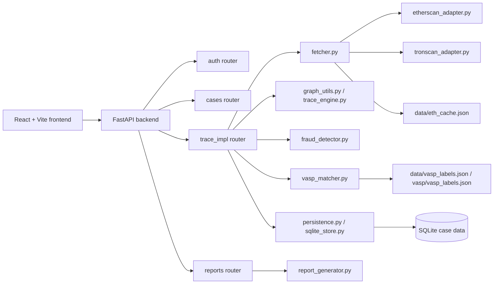

# CryptoTrace

CryptoTrace is a blockchain investigation prototype for tracing wallet fund flow, identifying downstream exposure, and surfacing suspicious transaction pathways from public blockchain data. Built for SIH 2026 — SIH26183 — the project is designed to support an investigator’s workflow: gather public transaction evidence, map bounded fund-flow relationships, apply contextual VASP/exchange labels, and generate a structured case review with trace details and reporting artifacts.

Live demo: https://crypto-trace-gold.vercel.app/

## Product Preview

CryptoTrace combines a React investigation UI with a FastAPI backend to support:

- source wallet tracing and bounded multi-hop exploration
- wallet-to-wallet relationship mapping
- suspicious path and cluster heuristics
- VASP/exchange context matching
- evidence ledger and report export

The project is intentionally scoped to investigation support and public blockchain analysis, not to real-world identity proof, legal enforcement, or private KYC resolution.

## The Problem

Investigators working on blockchain-related cases often need to manually piece together fund movement across multiple wallets, providers, and transaction histories. Public blockchain data is accessible but fragmented, difficult to normalize, and often noisy. The challenge is to turn noisy transaction records into a structured, explainable investigation trail without overstating certainty.

## The Solution

CryptoTrace provides a bounded investigation workflow around public blockchain evidence:

1. validate the wallet and chain input
2. retrieve transaction data from supported public providers
3. normalize and filter the raw transactions into evidence
4. build a bounded graph with hop constraints and cycle safety
5. identify suspicious paths, wallet clusters, and VASP-context matches
6. return the graph, evidence, summary, and report outputs for investigator review

## Why CryptoTrace

- It is designed for blockchain forensic workflows rather than generic wallet dashboards.
- It keeps a bounded graph and explicit evidence trail instead of treating all raw data as equal.
- It exposes a distinction between observed transactions and analytical interpretation.
- It keeps risk scoring, wallet clustering, and VASP matching in a transparent, explainable form.

## Key Capabilities

### Investigation

- wallet tracing for supported public chains
- bounded multi-hop exploration
- evidence filtering to keep only relevant outbound flow
- case-based workflow with saved results and report access

### Graph Intelligence

- wallet graph construction from normalized transaction records
- directed wallet-to-wallet relationships
- hop-aware visualization with source, intermediate, and downstream nodes
- graph payload generation for frontend investigation views
- bounded traversal using max-hop logic and cycle prevention

### Context & Intelligence

- VASP and exchange label matching from local label data
- wallet cluster heuristics based on repeated downstream activity
- suspicious-path analysis from observed relationship patterns
- confidence and explanatory metadata for analytical results

### Evidence & Reporting

- full evidence ledger in the backend response
- PDF and CSV report generation
- case lookup and report retrieval endpoints
- reproducible trace metadata and graph hash support

## Investigation Workflow

1. A user registers or logs in through the backend auth flow.
2. The frontend submits a case and wallet request to `POST /trace`.
3. The backend validates the wallet and chain, then fetches live or cached transactions.
4. Transaction records are normalized and restricted to relevant outbound flow.
5. The investigation graph is built for the bounded trace.
6. Risk heuristics, suspicious-path scoring, wallet clusters, and VASP context are computed.
7. The response includes graph data, evidence, and summary metrics.
8. The investigator can review the saved case and export PDF or CSV artifacts.

## System Architecture



## Investigation Graph

The graph is built from the normalized transaction evidence and represents fund-flow relationships between wallets. The important distinction is:

- the graph is a visual, bounded representation of wallet relationships
- the evidence ledger is the underlying transaction dataset
- multiple repeated transactions between the same wallet pair may be represented as one visual relationship for readability
- the raw transaction details remain available in the evidence and selection views

This is a key design choice for readability: a visually aggregated relationship does not delete the underlying evidence. The graph should be read as an investigative summary, while the evidence array remains the authoritative transaction record.

The graph logic is built around a bounded flow view with:

- source and victim wallet anchoring
- direct wallet relationships
- downstream multi-hop movement
- branch and convergence behavior
- suspicious-path emphasis
- cluster candidate grouping
- VASP-related labels when available

The backend explicitly retains a bounded traversal model so the graph remains explainable and does not drift into an unbounded transaction web.

## Evidence & Confidence Model

CryptoTrace separates several layers of interpretation:

| Layer | Description | Purpose |
| --- | --- | --- |
| Observed blockchain data | Raw provider transaction records and normalized fields | factual transaction evidence |
| Derived fund-flow relationships | wallet-to-wallet edges built from the transaction stream | relationship mapping |
| VASP / exchange context | matched labels from local contextual data | investigative context only |
| Analytical heuristics | clusters, suspicious path, risk scoring | interpretive lead generation |
| Confidence markers | confidence and risk metadata | explainability and analyst review |

Important: VASP and exchange labels are contextual signals, not proof of real-world identity, ownership, or criminality. They are treated as supporting investigative context in the same way a heuristic or pattern analysis would be treated.

## VASP / Exchange Context

The project includes a local VASP matching layer and label dataset. Relevant code paths include:

- `backend/services/vasp_matcher.py`
- `backend/data/vasp_labels.json`
- `backend/vasp/vasp_labels.json`

The matching logic is deterministic and exact-match based on a normalized address key. This means it can provide contextual labels where the dataset contains a known address, but it does not imply confirmed identity or legal attribution.

## Risk & Suspicious Activity Analysis

The risk analysis is implemented in `backend/services/fraud_detector.py` and includes:

- wallet-cluster heuristics
- common-input-ownership and peeling-chain style grouping
- suspicious path identification
- layered probability scoring across evidence
- risk factors and confidence signals
- evidence checksum support for trace consistency

The system is designed to generate analytical signals from observed behaviors, not to claim guilt or ownership.

## Screenshots / Product Showcase

This repository does not currently include a checked-in screenshot gallery or product image set. The live application is available at:

- https://crypto-trace-gold.vercel.app/

The repository is therefore best presented with the live demo link and the code-level architecture rather than fake or synthetic screenshots.

## Technology Stack

| Layer | Technology | Purpose |
| --- | --- | --- |
| Frontend | React + Vite | Investigation dashboard and UI flow |
| Backend | FastAPI | REST API and transaction orchestration |
| Data validation | Pydantic | Request and response validation |
| Graph analysis | NetworkX | Bounded graph traversal and relationship modeling |
| Blockchain adapters | Etherscan + TronScan integration | Public provider retrieval for ETH/TRON activity |
| Trace orchestration | Python service layer | normalization, fetch orchestration, risk logic |
| Persistence | SQLite | Case and user data storage |
| Reporting | ReportLab | PDF and CSV export generation |
| Environment config | python-dotenv | local `.env` settings |
| Testing | pytest | Backend regression testing |

## Repository Structure

```text
CryptoTrace/
├── backend/
│   ├── adapters/
│   ├── api/
│   ├── data/
│   ├── graph/
│   ├── models/
│   ├── reports/
│   ├── risk/
│   ├── services/
│   ├── vasp/
│   ├── .env.example
│   ├── README.md
│   ├── config.py
│   ├── main.py
│   ├── requirements.txt
│   └── tests/
├── frontend/
│   ├── src/
│   ├── public/
│   ├── vite.config.ts
│   ├── package.json
│   └── package-lock.json
├── docs/
│   ├── README.md
│   ├── JUDGE_QA_QUICKREF.md
│   └── CryptoTrace_Technical_Documentation.pdf
├── file/
├── README.md
├── SECURITY.md
├── CONTRIBUTING.md
├── docker-compose.yml
├── DEMO_VERIFICATION.md
├── run_demo.ps1
└── .gitignore
```

## API Overview

### Authentication

| Method | Path | Purpose |
| --- | --- | --- |
| POST | `/auth/register` | create a user and return a JWT-style token |
| POST | `/auth/login` | log in and return a token |
| GET | `/auth/me` | return the current authenticated user |

### Case access

| Method | Path | Purpose |
| --- | --- | --- |
| GET | `/cases` | list cases for the authenticated user |
| GET | `/cases/{case_id}` | fetch a saved case record |

### Trace and reports

| Method | Path | Purpose |
| --- | --- | --- |
| GET | `/health` | service health check |
| POST | `/trace` | trace one or more wallets and return graph/evidence summary |
| GET | `/reports/{case_id}.pdf` | generate a PDF report |
| GET | `/reports/{case_id}.csv` | generate a CSV evidence export |
| GET | `/reports/{case_id}.victim.pdf` | generate a plain-language victim-facing report |
| GET | `/schema` | return the agreed request/response schema |

## Local Development

### Backend

```powershell
cd backend
python -m venv .venv
.\.venv\Scripts\Activate.ps1
python -m pip install --upgrade pip
python -m pip install -r requirements.txt
python -m uvicorn main:app --reload --port 8000
```

### Frontend

```powershell
cd frontend
npm install
npm run dev -- --host 127.0.0.1 --port 5173
```

Open the app at:

- http://127.0.0.1:5173

## Environment Configuration

Copy the project defaults from `backend/.env.example` into a local `backend/.env` file and fill in the required values.

```env
APP_ENV=production
JWT_SECRET=replace-with-a-long-random-secret
PASSWORD_SALT=replace-with-a-second-long-random-secret
JWT_TTL_MINUTES=240
FRONTEND_URL=http://127.0.0.1:5173
CORS_ORIGINS=
PUBLIC_DEMO_CASE_ID=CASE-DEMO-REAL
USE_ETHERSCAN=true
ETHERSCAN_API_KEY=replace-with-etherscan-key
TRONSCAN_API_KEY=replace-with-tronscan-key
DEMO_MODE=false
REQUEST_TIMEOUT=15
MAX_RETRIES=3
BACKOFF_SECONDS=2
MAX_TRACE_WALLETS=25
MAX_TRACE_TRANSACTIONS=500
TRACE_TIMEOUT_SECONDS=45
MAX_HISTORICAL_PRICE_LOOKUPS=10
TRONSCAN_PAGE_SIZE=100
```

Notes:

- live provider access depends on valid API keys and chain configuration
- demo mode is opt-in and should remain off for real investigation work
- secrets must never be committed into the repository

## Testing & Verification

The repository includes a backend test suite under `backend/tests` and a frontend production build command.

### Backend tests

```powershell
cd .
$env:PYTHONPATH = "."
python -m pytest backend/tests -q
```

### Frontend build

```powershell
cd frontend
npm run build
```

### Verification status

- The frontend production build is a valid repo check and is intended to be run from `frontend/`.
- The backend pytest suite is present and structured around wallet tracing, graph logic, and provider behavior.
- In some local Windows environments, a temporary-directory permissions issue can prevent pytest from creating files in the system temp folder. This is an environment constraint and should be treated separately from the project’s application logic.

## Deployment

The live frontend deployment is verified at:

- https://crypto-trace-gold.vercel.app/

This repository includes a FastAPI backend and a Vite frontend, but backend hosting details should only be documented if they are verified in the actual deployment configuration. The project is best described as a public blockchain investigation prototype with a live frontend deployment, not as a production law-enforcement or KYC system.

## Security & Responsible Use

This system is designed for public blockchain investigation and contextual signal analysis. It does not provide:

- guaranteed real-world identity proof
- private KYC or bank access
- legal attribution or guilt determination
- automatic fund freezing or recovery
- definitive ownership proof for wallet addresses

All outputs should be treated as investigative leads supported by public blockchain evidence, contextual labels, and heuristics.

See [SECURITY.md](./SECURITY.md) for project-specific guidance on secrets, backend configuration, CORS, validation, and responsible vulnerability reporting.

## Limitations

CryptoTrace is best understood as an investigation-support prototype rather than a production-grade compliance system.

Current limitations include:

- public blockchain data is inherently partial and may not reflect all off-chain activity
- VASP labels are contextual and may not prove ownership or control
- graph visualization is bounded for readability and relationship clarity
- public-provider availability and rate limits may affect live retrieval
- the project is built for investigative analysis and not for operational enforcement workflows

## Roadmap

### Implemented

- FastAPI backend with case and report APIs
- ETH and TRON public provider integration paths
- bounded multi-hop trace flow
- graph generation and wallet relationship mapping
- suspicious-path and cluster heuristics
- VASP/exchange label matching
- evidence ledger and report generation
- frontend investigation UI with local API proxy and runtime API base configuration

### Next

- strengthen provider-fallback and error-reporting UX
- broaden documentation and onboarding quality
- improve operational observability for tracing and provider issues
- refine large-graph readability and analyst-focused graph summarization

### Future

- broader chain coverage and provider normalization
- stronger analyst workflow tooling
- deeper cross-case analytics and evidence review
- production-grade deployment hardening and governance controls

## Contributing

See [CONTRIBUTING.md](./CONTRIBUTING.md) for contributor expectations, scope discipline, testing guidance, and repository hygiene rules.

## License

No explicit license file is present in the repository at this time. Before the project is published more broadly, the project owners should decide on the appropriate open-source license for the repository.

## Team / Project Information

- Project: CryptoTrace
- Problem statement: SIH26183
- Theme: Blockchain & Cybersecurity
- Government partner: Ministry of Home Affairs / I4C
- Initiative: Smart India Hackathon 2026

## Final Note

CryptoTrace is a focused public-blockchain investigation prototype. It is designed to help an analyst review fund-flow patterns, suspicious relationships, and contextual evidence, while staying transparent about the difference between observed blockchain data, derived analytical signals, and real-world attribution.
