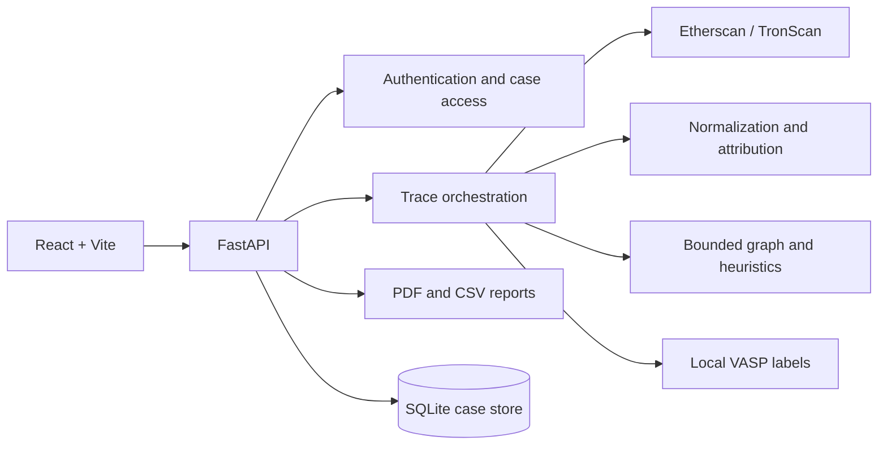

# CryptoTrace

CryptoTrace is a public-blockchain investigation prototype. It helps an analyst trace bounded wallet-to-wallet flow, preserve transaction evidence, add locally maintained VASP or service context where available, and review the result in a case workspace.

**Live frontend:** <https://crypto-trace-gold.vercel.app/>

> CryptoTrace supports investigative review of public data. It does not establish a person's identity, ownership of an address, criminal activity, or a legal conclusion.

## What it does

- Traces supported wallet activity with a bounded, cycle-safe traversal of up to three hops.
- Normalizes provider records into a common evidence format and retains the evidence ledger behind the graph.
- Presents aggregated wallet relationships, transaction direction, hop-aware views, and case history in the React workspace.
- Produces an evidence-based `risk_score` (0-100) separately from `trace_confidence`.
- Adds exact-match VASP/service labels from local label data when a label exists.
- Saves cases in SQLite and exports investigator PDF, victim-friendly PDF, CSV, and JSON evidence views.

## Investigation workflow

1. Register or sign in to create a private case history.
2. Submit a source wallet, chain, and optional transaction, amount, asset, or case identifier.
3. The backend validates the address, retrieves configured provider data (or explicitly enabled demo data), normalizes records, and builds a bounded trace.
4. Review the graph as a compact relationship view and the evidence ledger as the transaction-level record.
5. Review risk factors, trace confidence, entity context, and any partial-trace notice before exporting a report.

### Reading the results

| Output | Meaning | What it does not mean |
| --- | --- | --- |
| Evidence | Normalized public transaction records used by the trace | A complete record of off-chain activity |
| Graph relationship | A visual aggregation of observed transactions between wallets | Proof that wallets share an owner or intent |
| Risk score | A 0-100 heuristic calculated from recorded evidence | Proof of fraud or criminality |
| Trace confidence | A separate indication of trace completeness/context | A risk score or identity confidence |
| VASP/service match | An exact match in local contextual label data | KYC, ownership, or legal attribution |

The graph may aggregate repeated transactions for readability. Selecting a relationship exposes its underlying transactions; the evidence ledger remains the authoritative transaction record in the response.

## Supported retrieval paths

| Path | Provider | Notes |
| --- | --- | --- |
| EVM-compatible addresses | Etherscan V2 | The backend maps ETH, BSC, Polygon, Arbitrum, and Base chain identifiers. Availability depends on the configured provider key and provider support. |
| TRON Base58 addresses | TronScan | Requires a backend-only `TRONSCAN_API_KEY`; addresses are validated with Base58Check validation. |
| Demo data | Repository cache | Explicit opt-in with `DEMO_MODE=true`; it is never presented as live data. |

## Architecture



## Repository layout

```text
backend/                 FastAPI API, adapters, analysis services, tests, and seed data
frontend/                React/Vite investigation interface
docs/                    Supporting technical and judge-facing documentation
demo_verification/       Captured demonstration artifacts (historical reference)
file/                    Supplied project and competition reference material
CONTRIBUTING.md          Contribution expectations
SECURITY.md              Security and responsible-use guidance
DEMO_VERIFICATION.md     Context for the captured demonstration artifacts
docker-compose.yml       Local two-container setup
run_demo.ps1             Windows setup reminder
```

## API overview

| Method | Path | Access | Purpose |
| --- | --- | --- | --- |
| `GET` | `/health` | Public | Service health check |
| `POST` | `/auth/register` | Public | Create a user and return a token |
| `POST` | `/auth/login` | Public | Sign in and return a token |
| `GET` | `/auth/me` | Bearer token | Return the current user |
| `POST` | `/trace` | Optional bearer token | Run and persist a bounded trace |
| `GET` | `/cases` | Bearer token | List the caller's private cases |
| `GET` | `/cases/{case_id}` | Case access | Load a saved case |
| `GET` | `/reports/{case_id}.pdf` | Case access | Investigator PDF |
| `GET` | `/reports/{case_id}.victim.pdf` | Case access | Plain-language PDF |
| `GET` | `/reports/{case_id}.csv` | Case access | CSV evidence export |
| `GET` | `/schema` | Public | Illustrative request/response contract |

`/trace` accepts `wallets`, `source_wallet`, or `address`; it also accepts optional `tx_hash`, `amount`, `currency`, `max_hops`, and date bounds. `max_hops` is constrained to 1-3. See [`backend/api/trace_impl.py`](backend/api/trace_impl.py) for the current request contract.

## Run locally

### Prerequisites

- Python 3.11+ recommended
- Node.js 20+ recommended
- An Etherscan key for live EVM retrieval and a TronScan key for live TRON retrieval

### Backend

Run these commands from the repository root. Running `main:app` from `backend/` is not supported because the application imports the `backend` package from the root.

```powershell
python -m venv .venv
.\.venv\Scripts\Activate.ps1
python -m pip install --upgrade pip
python -m pip install -r backend/requirements.txt
Copy-Item backend/.env.example backend/.env
python -m uvicorn backend.main:app --reload --port 8000
```

### Frontend

In a second terminal:

```powershell
cd frontend
npm install
npm run dev -- --host 127.0.0.1 --port 5173
```

Open <http://127.0.0.1:5173>. Without `VITE_API_BASE_URL`, Vite proxies API requests to `http://127.0.0.1:8000`.

### Docker Compose

Create `backend/.env` first, then run from the repository root:

```powershell
docker compose up --build
```

The frontend container is available on <http://127.0.0.1:5173> and proxies API requests to the backend container.

## Configuration

Copy [`backend/.env.example`](backend/.env.example) to `backend/.env`. Keep provider credentials and authentication secrets backend-side.

| Variable | Required for | Notes |
| --- | --- | --- |
| `JWT_SECRET`, `PASSWORD_SALT` | Any non-development deployment | Use unique, long secret values. |
| `ETHERSCAN_API_KEY` | Live EVM retrieval | Required when live EVM mode is enabled. |
| `TRONSCAN_API_KEY` | Live TRON retrieval | Required for TRON; never expose it in `VITE_*` variables. |
| `USE_ETHERSCAN` | Provider mode | Defaults to `true`; the current setting governs live retrieval. |
| `DEMO_MODE` | Cached demonstration data | Defaults to `false`; enable explicitly for the repository fixture. |
| `FRONTEND_URL`, `CORS_ORIGINS` | Browser deployments | Comma-separated allowed origins; localhost and the current Vercel origin are included by default. |
| `MAX_TRACE_WALLETS`, `MAX_TRACE_TRANSACTIONS`, `TRACE_TIMEOUT_SECONDS` | Safety bounds | Limit traversal scope and execution time. |

For a Vercel frontend, set `VITE_API_BASE_URL` to the public HTTPS backend URL at build time. The frontend accepts `VITE_API_URL` as a legacy alias. Configure the corresponding frontend origin on the backend through `FRONTEND_URL` or `CORS_ORIGINS`.

## Validate changes

```powershell
# From the repository root
$env:PYTHONPATH = "."
python -m pytest backend/tests -q

# From frontend/
npm run build
```

The backend suite covers graph traversal, attribution, risk scoring, provider normalization, TRON validation, report generation, and provider error paths. The frontend currently has no separate automated test runner; its production build is the repository check for frontend changes.

## Deployment

The public frontend is hosted at <https://crypto-trace-gold.vercel.app/>. A production frontend deployment needs `VITE_API_BASE_URL` set to the backend's public HTTPS URL. The backend must keep its secrets server-side and allow the frontend origin through its CORS configuration.

This repository includes Dockerfiles and `docker-compose.yml` for containerized local operation. It does not include infrastructure-as-code for a particular hosted backend provider; configure provider secrets, SQLite persistence, CORS, and deployment storage for the chosen environment.

## Security, limitations, and responsible use

Read [SECURITY.md](SECURITY.md) before operating against live providers. In particular:

- Do not commit `.env` files, API keys, JWT secrets, or salts.
- Public blockchain data, graph relationships, labels, and heuristics are investigative context only.
- Provider rate limits, provider coverage, bounded traversal, and off-chain activity limit what a trace can show.
- A label match, cluster, or investigative lead is not proof of a person's identity or wrongdoing.

## Contributing and project material

See [CONTRIBUTING.md](CONTRIBUTING.md) for scope and verification expectations. Supporting material is indexed in [docs/README.md](docs/README.md); captured demonstration artifacts are described in [DEMO_VERIFICATION.md](DEMO_VERIFICATION.md).

## License

No license file is currently provided. Project owners should choose and add a license before representing the repository as open-source licensed.
